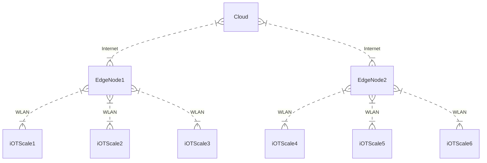
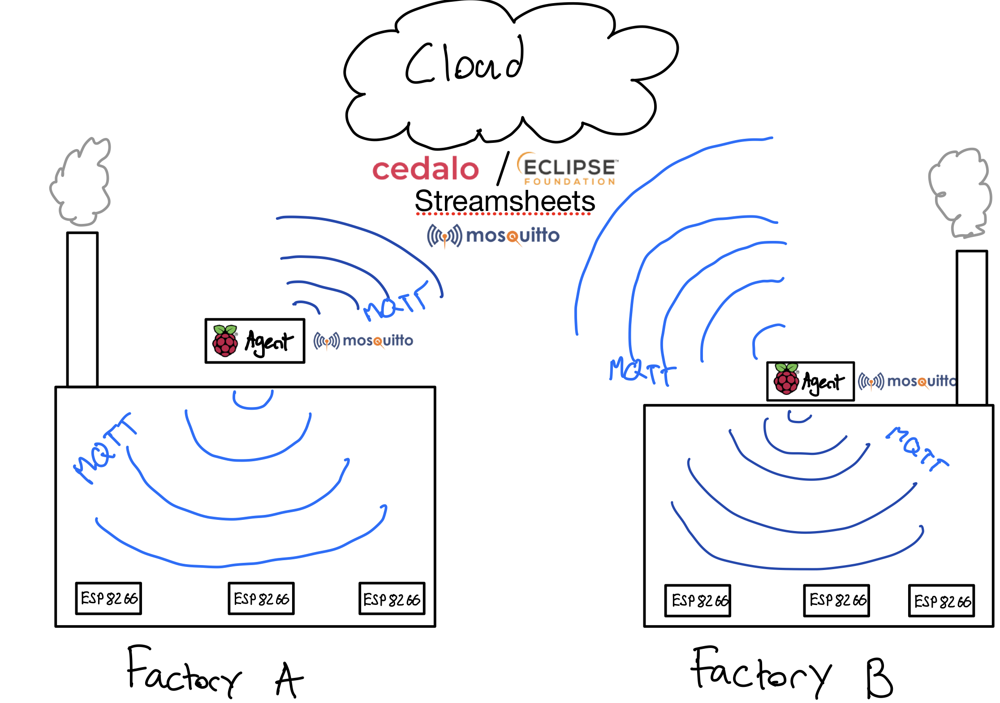
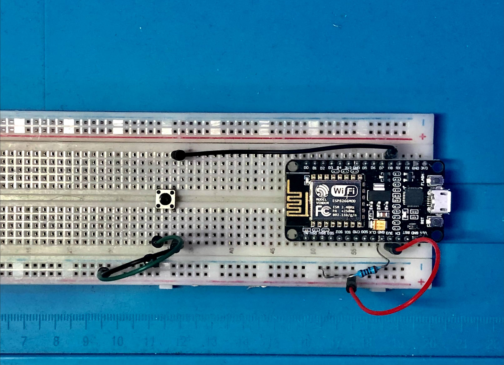
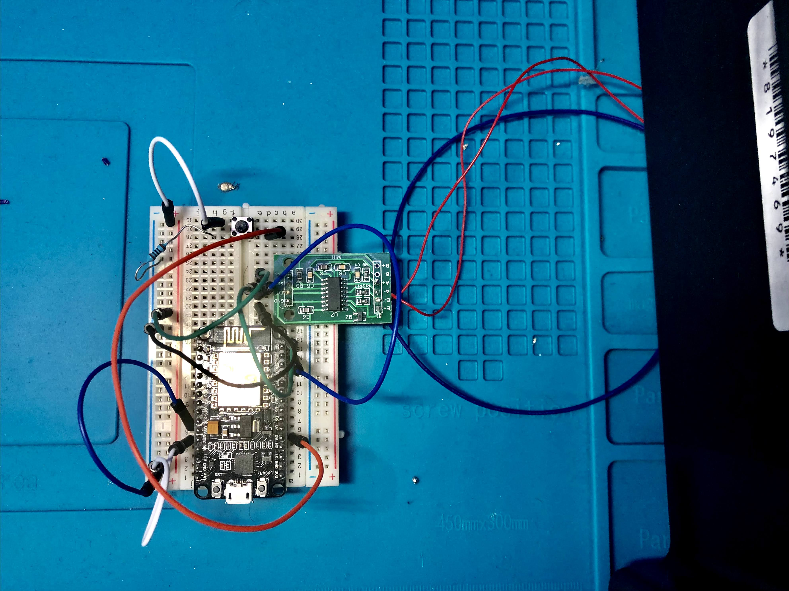

[TOC]

# Scale-ing Inventory Management

An inventory system that scales. 

(v1.0.0, Fri sep 18)

## Business case and Use Case

#### What is the problem? 


> "Do you stop warehouse operations for days to physically count items and  make sure that count matches the data stored in your software? This is  an absolutely unnecessary, costly and outdated mindset." - [Brian Sutter](https://www.entrepreneur.com/article/252704)


Tracking inventory can be a major sore point for many manufacturing based companies. Many tracking systems exist for inventory coming in and out of the factory, but what about goods which are consumed within the factory itself?

The following is a hypothetical business situation which better describes the problem. You are a global manufacturing company that has assembly plants all over the world. Corporate relies on monthly inventory checks by staff in order to make purchasing decisions. By the time inventory is counted and a monthly count is submitted, the data is invalid because material is constantly being used internally to keep manufacturing moving. Another factor which limits the accuracy of data is human error when manually performing inventory counts. The delay and potential inaccuracy of data available to lead decision makers causes many of the plants to face a situation where they have a deficit in a required part and can no longer continue production. How can we keep track of dynamically changing inventory counts, and measure them more frequently without having to manually count the inventory every single day?

Not having enough inventory may cause a business to miss crucial opportunities, while having too much inventory can [cause loss though storage costs.](https://www.entrepreneur.com/article/21842)

#### What is the solution

The solution leverages both IoT and edge computing. Sensors, on one hand, can alleviate the need for manual inventory tracking. Edge Computing, on the other hand, makes it possible to locally process data and send batch updates to the cloud. In other words: relying on edge computing means that we can locally process, and bundle data, saving bandwidth when talking to the cloud. we can orchestrate a network of low power computers, microprocessors and sensors that can handle collecting and processing inventory data within the factory. We can then aggregate the many different streams of data created by each factory into one Cloud dashboard that decision makers can leverage to make insightful decisions for the company.

#### *Why is this important?*

Manual tracking of inventory is a control issue, since management has to rely on often outdated and potentially incorrect data due to human error. By utilising IoT we can effectively have an accurate inventory count available in real time. With this constant flow of data we are able to derive metrics which show how goods are being consumed, so that management can optimise the supply chain as well as inventory levels

#### *Key benefits*

- Live cross factory inventory tracking
- Live Dashboard produced
- Easily deployable and saleable

**Keywords/Verticals:** Inventory management, iOT, Fog Computing, data management.

## Architecture

#### *Visual representation of the solution.*





#### What components is the demo using?

###### Software Components

- **[Eclipse Mosquitto](https://mosquitto.org/)**
  - Light weight messaging protocol which works over tcp/ip
- **[Eclipse Streamsheets](https://cedalo.com/)**
  - Allows for easy aggregation all while allowing for very beautiful UI/Dashboards.
-  **[Eclipse ioFog](https://ioFog.org/)**
  - Used to easily orchestrate and build, deploy and manage network nodes.

**Hardware Components**

- 2 Raspberry Pi's
- Home/Cloud ubuntu server
- ESP8266 x3
- 4pcs 50kg Half-bridge Load Cell + 1pc HX711
- Plastic Bin

## Implementation

[Link to the GitHub repo for the code](https://github.com/GregoryIvo/Scale-ingInventoryManagement)


**Cloud Layer:**

Eclipse Streamsheets allows for us to easily aggregate and visualise data flows. For this reason, It will be run on the cloud node and will oversee all the data produced by the smart factories.  Another benefit that is provided by Eclipse Streamsheets are the many different pre-configured services that run on the image; such as Eclipse Mosquitto, and Mongo DB.


**Edge Agent Layer:**

The goal of this demo is to demonstrate how Eclipse ioFog can easily orchestrate a multi-Edge network, over the public internet, and allow for dynamic configurations between each node. In this demo, ioFog was utilised to deploy pre-made docker containers which hold a software stack consisting of Eclipse Mosquitto, Express web-server, and 2 different MQTT clients to send and receive messages across the network.


**Internet of Things Layer:**

The low-power ESP8266 was leveraged to bring data-collection directly at the point in which data is created. These boards combined with a set of load cells allow us to accurately derive the number of items in a plastic bin. These boards, are then able to publish the counts via MQTT over WLAN to the Edge layer.


**How the Data Flows Between Layers**

1. Data is created, recorded, and published from ESP8266 to WLAN Eclipse Mosquitto MQTT broker running on agent.
2. Client Running on Agent consumes published data, stores and packages data to be displayed on express web server and is then published to Eclipse Mosquitto running on the Cloud over the public internet
3. Eclipse Streamsheets consumes data published by the Agent, data is then used for visualisation, storage and for other functions end user configures.


## How to run

***Note:*** to make installation easier, it is recommended to install portaner on the 'master-agent' machine


##### 1) Set up Eclipse Streamsheets on desired agent

```bash
docker run -d -p 1883:1883 -p 27017:27017 -p 6379:6379 -p 8080:8080 -p 8081:8081 -p 8083:8083 -p 8088:8088 -p 9001:9000 cedalo/streamsheets:latest
```


2) Find MQTT password for internal Eclipse Streamsheets  Mosquitto server

go to Eclipse Streamsheets web portal > Hamburger menu > Administration > consumers > MQTT_Consumer > scroll down, to review username and password

 

##### 3) Configure ioFog related .YAML files

```bash
cd ioFog
```

edit ControlPlaneSetup.yaml & StreamsheetsAgentConfig.yaml, to match your required configuration. 

all fields that should be edited have been marked with a #


##### 4) Network provisioning

in order for Eclipse ioFog for function, one must prepare the network. This means that the machine which runs iofogctl can ssh into all machines without a password,  run sudo commands without being asked for a password, and lastly, network ports must be opened to allow for ssh, and web socket connection to occur.

for further explanation please read the ioFog documentation:

https://ioFog.org/docs/2/platform-deployment/prepare-your-network.html

 https://ioFog.org/docs/2/platform-deployment/prepare-your-remote-hosts.html


This demo Relies on using mqtt between all agents and Eclipse Streamsheets, therefore one will most likely need to also port-forward 1883 TCP

###### In the demo, 3 Ubuntu machines were used, and 2 raspberry pi's.

- Ubuntu #1: developer's pc, used to run ioFogctl
- Ubuntu #2: cloud instance, runs ioFog-controller
- Ubuntu #3: hosts Eclipse Streamsheets
- raspberry pi #1: Agent, which runs the scaling-inventory software
- raspberry pi #2: Agent, which runs the scaling-inventory software
- raspberry pi #3: Agent, which runs the scaling-inventory software


##### 5) Deploy Control Plane

```bash
cd ioFog
ioFogctl deploy -f ControlPlaneSetup.yaml

#if this fails using the following command to figure out what is going wrong
ioFogctl deploy -v -f ControlPlaneSetup.yaml --debug
```


##### 5) Deploy Agents

```bash
ioFogctl deploy -f StreamsheetsAgentConfig.yaml

#if this fails using the following command to figure out what is going wrong
ioFogctl deploy -v -f StreamsheetsAgentConfig.yaml --debug
```


##### 5.5) building docker containers from scratch To Build Docker image from scratch

```bash
#only need to do this if the geevo/eclipse-smartfactory:<version> repo is down/discontinued
cd docker
docker build --no-cache --tag geevo/eclipse-smartfactory:<version> .
docker run -p 8080:8080 -p 1883:1883 -d geevo/eclipse-smartfactory:<version>
```


##### 6) configure Arduino devices 

In this demo, the NODE MCU 1.0 is used.

use-case one as a clicker, which when pressed sends mqtt message to its configured agent, informing of how many times its been  clicked




use-case two, a series of load cells is used to count the number of items in a bin, and when there is a change a message is published to the configured agent.




to install, open respective arduino sketch located in the Arduino file. 

Change the parameters for wifi, mqtt, and other properties.

###### Install required libraries:

​			**1) NodeMCU library:** https://arduino.esp8266.com/stable/package_esp8266com_index.json

​			**2) PubSubClient:**  https://github.com/knolleary/pubsubclient

​			**3) Arduino_JSON:** https://arduinojson.org/

​			**4) HX711 (loadcell library):** https://github.com/bogde/HX711/blob/master/src/HX711.h

​			**5) upload the sketch**

Both devices should automatically connect to the configured wifi-network, and post a message to the MQTT server which was defined upon creation of data.

